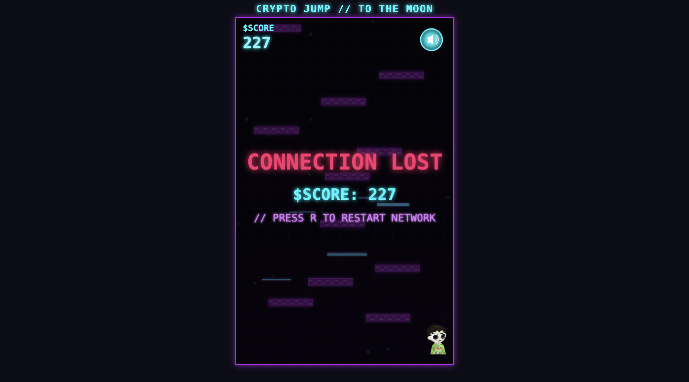

# Crypto Jump: To The Moon

A cyberpunk-themed endless jumper game inspired by the classic Doodle Jump. Leap upward through platforms, avoid or shoot monsters, and see how high you can score in this neon-infused arcade experience.

## Preview



## Features

- **Endless Gameplay**: Jump higher and higher with increasing difficulty
- **Cyberpunk Aesthetic**: Neon colors, retro grid effects, and futuristic visuals
- **Monster Enemies**: Shoot or avoid various monsters that try to stop your ascent
- **Power-ups**: Collect items to enhance your jumping abilities
- **Responsive Design**: Play on desktop or mobile devices
- **Background Music**: Toggle-able soundtrack with custom controls

## How to Play

The goal is simple: jump as high as possible without falling or hitting enemies. Your character automatically jumps when landing on platforms. The game gets progressively harder the higher you go, with platforms becoming scarcer and enemies more frequent.

### Controls

#### Desktop:
- **A/D or Arrow Keys**: Move left/right
- **Space**: Shoot
- **M**: Toggle music
- **R**: Restart game (when game over)

#### Mobile:
- **Tap left/right side**: Move left/right
- **Red Button**: Shoot
- **Music Icon**: Toggle music
- **Tap anywhere**: Restart (when game over)

## Installation

1. Clone this repository
```bash
git clone https://github.com/Wacaflow/crypto-jump-game.git
```

2. Open `index.html` in a web browser to play

Alternatively, you can play the game directly at: [https://wacaflow.github.io/crypto-jump-game](https://wacaflow.github.io/crypto-jump-game)

Or host it yourself on GitHub Pages for free:
1. Fork this repository from [https://github.com/Wacaflow/crypto-jump-game](https://github.com/Wacaflow/crypto-jump-game)
2. Go to Settings > Pages
3. Select your main branch and save

## Deployment

This game is built with vanilla JavaScript and HTML5 Canvas, making it easy to deploy anywhere that serves static files. Some options include:

- GitHub Pages
- Netlify
- Vercel
- Any standard web hosting

## Technologies Used

- HTML5 Canvas
- Vanilla JavaScript
- CSS3

## Development

Want to contribute? Great! Feel free to fork this repository and submit pull requests.

## License

This project is licensed under the terms of the MIT License.

---

Enjoy jumping to the moon! 🚀
